# 🚇 GitMetro Action

> **A GitHub Action that turns your contribution history into an animated, vector subway transit map.**

Your commits build station stops and hubs (local stops, transfer junctions, and massive terminal hubs). Your stars scale up subway train clock speeds, unresolved issues display delay warnings on sectors of the grid, and active streaks determine overall transit efficiency.



---

## 🚉 How It Works

This action queries your public profile metrics and compiles a custom vector SVG. Using SVG `<animateMotion>` and basic CSS animations, it slides glowing neon train cars with passenger windows along line paths, scales in stations on page load, and pulses orange hazard blinker boxes at delay zones.

### The Subway Mapping

| GitHub Entity | Transit Counterpart |
|---|---|
| 📦 Weekly Commits | Station size & type (Local, Standard, Junction, Terminal Hub) |
| ⚡ Star Count | Clock speed (Hz) & metro train velocity (speeds up loop duration) |
| 🚧 Open Issues | Construction tracks & orange delay hazard blinkers |
| 🔄 Closed Issues / PRs | Auxiliary intersecting lines (connects points together) |
| 🎨 Top Language | Metro Line color (JS=yellow, TS=blue, Python=green, Go=teal, Rust=red) |
| 🔥 Active Streak | System status efficiency diagnostics rating (EXCELLENT, NORMAL) |

---

## 🚀 Setup (2 Steps)

### Step 1: Add the workflow to your profile repository
Create a workflow file in your profile repository (e.g., `Dasmat13/Dasmat13`) at:
`.github/workflows/metro.yml`

Paste the following:

```yaml
name: GitMetro — Update Profile

on:
  schedule:
    - cron: '0 23 * * *'   # Runs daily
  workflow_dispatch:

jobs:
  metro:
    runs-on: ubuntu-latest
    permissions:
      contents: write
    steps:
      - uses: actions/checkout@v4

      - name: Generate GitMetro SVG
        uses: Dasmat13/git-metro-action@main
        with:
          github_user_name: ${{ github.actor }}
          github_token: ${{ secrets.GITHUB_TOKEN }}
          svg_out_path: dist/metro.svg

      - name: Commit & Push SVG
        run: |
          git config user.name  "github-actions[bot]"
          git config user.email "github-actions[bot]@users.noreply.github.com"
          git add dist/metro.svg
          git diff --cached --quiet || git commit -m "🚇 Update GitMetro [$(date +'%Y-%m-%d')]"
          git push
```

### Step 2: Add to your profile README.md

Add this Markdown image link:

```markdown

```

Trigger the Action manually once, and get your transit lines running!

---

## 🛠️ Local Development

```bash
git clone https://github.com/Dasmat13/git-metro-action.git
cd git-metro-action
npm install
npm run build
```

---

## 📄 License

MIT © [Dasmat13](https://github.com/Dasmat13)
